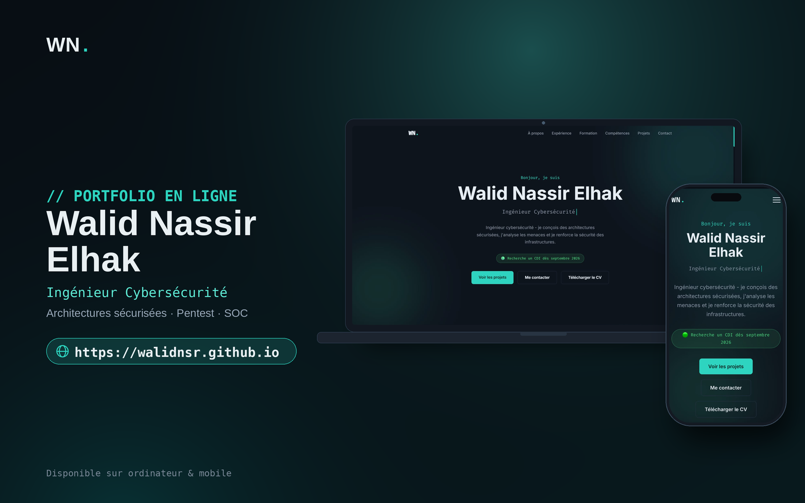

# 🔐 Portfolio - Walid Nassir Elhak

Portfolio personnel d'un **ingénieur en cybersécurité** : conception d'architectures sécurisées, test d'intrusion (pentest) et défense des systèmes d'information. Vous y trouverez mon parcours, mes expériences professionnelles, mes projets et mon CV.

🌐 **Site en ligne : [walidnsr.github.io](https://walidnsr.github.io/)**

---

© 2026 Walid Nassir Elhak — Tous droits réservés.
Le code et le contenu de ce site sont protégés. Toute reproduction ou réutilisation sans autorisation est interdite.
